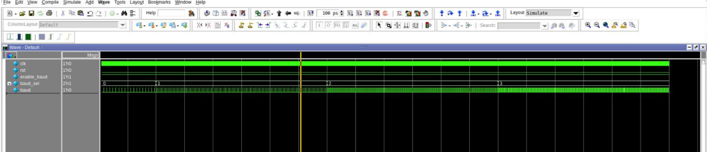
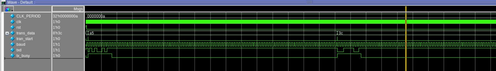
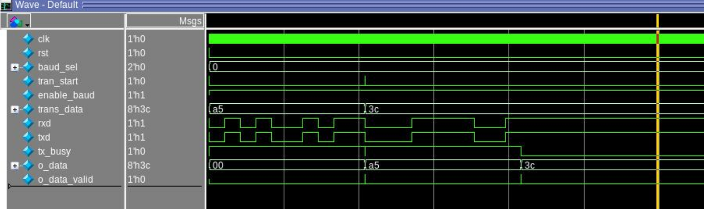
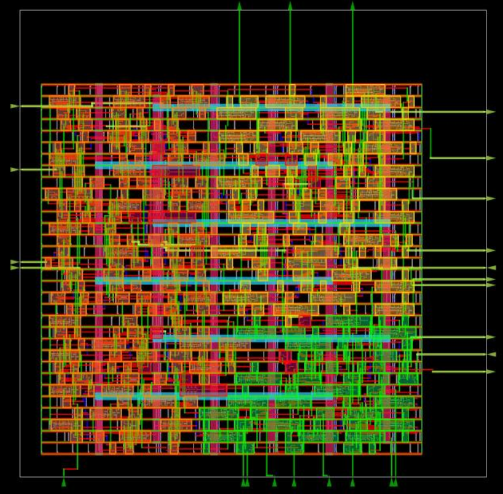

# 8-bit UART: RTL to GDS2 Implementation

A complete implementation of an 8-bit Universal Asynchronous Receiver-Transmitter (UART) designed from RTL to physical layout using the SkyWater 130nm PDK and OpenROAD digital flow.

## 📋 Table of Contents
- [Overview](#overview)
- [Features](#features)
- [Design Architecture](#design-architecture)
- [Project Structure](#project-structure)
- [Prerequisites](#prerequisites)
- [Installation & Setup](#installation--setup)
- [Usage](#usage)
- [Simulation Results](#simulation-results)
- [Synthesis & Physical Design](#synthesis--physical-design)
- [Results & Statistics](#results--statistics)
- [Future Enhancements](#future-enhancements)
- [License](#license)

## 🎯 Overview

This project demonstrates a complete digital ASIC design flow for an 8-bit UART communication peripheral. The design starts from behavioral RTL code written in Verilog and goes through the entire digital design flow to produce a final GDS2 layout ready for fabrication using the open-source SkyWater 130nm process.

### Key Highlights
- **Custom RTL Design**: Hand-written Verilog modules with proper FSM-based control
- **Multi-baud Support**: Selectable baud rates (9600, 19200, 38400, 57600)
- **Complete Verification**: Testbenches for each module and full system integration
- **Open-Source PDK**: Uses SkyWater 130nm technology with OpenROAD flow
- **Physical Design**: Complete placement and routing with timing constraints

## ✨ Features

### Functional Features
- **8-bit Data Transmission**: Full duplex UART communication
- **Configurable Baud Rates**: 4 selectable rates via 2-bit control
  - 9600 bps (default)
  - 19200 bps
  - 38400 bps
  - 57600 bps
- **Standard UART Protocol**: 1 start bit, 8 data bits, 1 stop bit
- **Handshake Signals**: tx_busy and data_valid indicators
- **50 MHz System Clock**: With fractional-N frequency synthesis for baud generation

### Technical Features
- Synthesizable Verilog RTL
- Formal FSM-based design
- Asynchronous reset support
- Modular architecture with clear hierarchy
- Gate-level netlist generation
- Timing-driven physical implementation

## 🏗️ Design Architecture

### Block Diagram
```
                    +------------------+
                    |   UART (Top)     |
                    |                  |
   clk ------------>|                  |
   rst ------------>|                  |
   baud_sel[1:0]--->|  +-----------+   |
   enable_baud ---->|  | Baud Rate |   |
                    |  | Generator |   |
   tran_start ----->|  +-----------+   |
   trans_data[7:0]->|       |          |
                    |       v          |
                    |  +------------+  |----> txd
                    |  |Transmitter |  |
                    |  +------------+  |----> tx_busy
                    |                  |
   rxd ------------>|  +------------+  |
                    |  |  Receiver  |  |----> o_data[7:0]
                    |  +------------+  |----> o_data_valid
                    |                  |
                    +------------------+
```

### Module Descriptions

#### 1. **uart.v** (Top Module)
The top-level module that instantiates and connects all sub-modules. It provides the external interface for the UART system.

**Ports:**
- `clk`: System clock (50 MHz)
- `rst`: Active-high asynchronous reset
- `baud_sel[1:0]`: Baud rate selection (00=9600, 01=19200, 10=38400, 11=57600)
- `enable_baud`: Enable signal for baud rate generator
- `tran_start`: Trigger to start transmission
- `trans_data[7:0]`: 8-bit parallel data to transmit
- `rxd`: Serial receive data input
- `txd`: Serial transmit data output
- `tx_busy`: Transmitter busy flag
- `o_data[7:0]`: Received parallel data output
- `o_data_valid`: Received data valid flag

#### 2. **baud_rate_selector.v** (Baud Generator)
Implements a fractional-N frequency synthesizer using a 24-bit accumulator to generate precise baud rate ticks from the system clock.

**Algorithm:**
```
M = (baud_rate × 2^24) / clock_frequency
```

For 50 MHz clock:
- 9600 bps: M = 3221
- 19200 bps: M = 6442
- 38400 bps: M = 12885
- 57600 bps: M = 19327

#### 3. **transmitter.v** (TX Module)
FSM-based UART transmitter that serializes 8-bit parallel data.

**States:**
- `IDLE`: Waiting for transmission start
- `START`: Sending start bit (logic 0)
- `DATA`: Sending 8 data bits (LSB first)
- `STOP`: Sending stop bit (logic 1)

#### 4. **reciever.v** (RX Module)
FSM-based UART receiver that deserializes incoming serial data.

**States:**
- `STATE_IDLE`: Waiting for start bit
- `STATE_DATA_BITS`: Sampling data bits
- `STATE_STOP_BIT`: Verifying stop bit
- `STATE_CLEANUP`: Latching received data

## 📁 Project Structure

```
uart-rtl-to-gds2/
│
├── rtl/                          # RTL Source Files
│   ├── UART.v                    # Top-level UART module
│   ├── baud_rate_selector.v      # Baud rate generator
│   ├── transmitter.v             # UART transmitter
│   └── reciever.v                # UART receiver
│
├── testbench/                    # Verification Files
│   ├── tb_uart.v                 # Top-level UART testbench
│   ├── tb_transmitter.v          # Transmitter testbench
│   ├── tb_reciever.v             # Receiver testbench
│   └── tb_baud_sel_gen.v         # Baud generator testbench
│
├── synthesis/                    # Synthesis Files
│   ├── yos.ys                    # Yosys synthesis script
│   └── uart_netlist.v            # Generated gate-level netlist
│
├── pnr/                          # Place & Route Files
│   ├── uart_sky130hd.tcl         # OpenROAD flow configuration
│   ├── uart_sky130.sdc           # Timing constraints (SDC)
│   └── uart_sky130hd_route-tcl.def # Final layout DEF file
│
├── docs/                         # Documentation
│   ├── waveforms/                # Simulation waveforms (add your images here)
│   └── layout/                   # Layout screenshots (add your images here)
│
├── scripts/                      # Automation Scripts
│   ├── run_simulation.sh         # Run all testbenches
│   └── run_synthesis.sh          # Run synthesis flow
│
├── RESULTS.md                    # Detailed results and analysis
└── README.md                     # This file
```

## 🔧 Prerequisites

### Required Tools

1. **Verilog Simulator** (choose one):
   - Icarus Verilog (iverilog) - Free, open-source
   - ModelSim/QuestaSim
   - VCS
   - Verilator

2. **Synthesis Tool**:
   - Yosys (open-source)

3. **PDK (Process Design Kit)**:
   - SkyWater 130nm PDK (open_pdks)
   - Installation: https://github.com/RTimothyEdwards/open_pdks

4. **Physical Design Tool**:
   - OpenROAD (open-source)
   - Installation: https://github.com/The-OpenROAD-Project/OpenROAD

5. **Waveform Viewer** (optional):
   - GTKWave
   - Verdi
   - DVE

### Installation Steps

#### 1. Install Icarus Verilog
```bash
# Ubuntu/Debian
sudo apt-get update
sudo apt-get install iverilog gtkwave

# macOS
brew install icarus-verilog gtkwave
```

#### 2. Install Yosys
```bash
# Ubuntu/Debian
sudo apt-get install yosys

# From source
git clone https://github.com/YosysHQ/yosys.git
cd yosys
make
sudo make install
```

#### 3. Install SkyWater PDK
```bash
git clone https://github.com/RTimothyEdwards/open_pdks.git
cd open_pdks
./configure --enable-sky130-pdk
make
sudo make install
```

#### 4. Install OpenROAD
```bash
# Follow instructions at:
# https://github.com/The-OpenROAD-Project/OpenROAD
```

## 🚀 Installation & Setup

### Clone the Repository
```bash
git clone https://github.com/yourusername/uart-rtl-to-gds2.git
cd uart-rtl-to-gds2
```

### Verify Installation
```bash
# Check Icarus Verilog
iverilog -v

# Check Yosys
yosys -V

# Check OpenROAD
openroad -version
```

## 💻 Usage

### 1. RTL Simulation

#### Simulate Individual Modules

**Baud Rate Generator:**
```bash
cd testbench
iverilog -o baud_sim tb_baud_sel_gen.v ../rtl/baud_rate_selector.v
vvp baud_sim
gtkwave baud_waveform.vcd
```


**Transmitter:**
```bash
iverilog -o tx_sim tb_transmitter.v ../rtl/transmitter.v ../rtl/baud_rate_selector.v
vvp tx_sim
gtkwave tx_waveform.vcd
```


**Receiver:**
```bash
iverilog -o rx_sim tb_reciever.v ../rtl/reciever.v ../rtl/baud_rate_selector.v
vvp rx_sim
gtkwave rx_waveform.vcd
```


**Full UART System:**
```bash
iverilog -o uart_sim tb_uart.v ../rtl/UART.v ../rtl/transmitter.v ../rtl/reciever.v ../rtl/baud_rate_selector.v
vvp uart_sim
gtkwave uart_waveform.vcd
```


### 2. Synthesis with Yosys

The synthesis process converts RTL code to a gate-level netlist using the SkyWater 130nm standard cell library.

```bash
cd synthesis
yosys yos.ys
```

**What the script does:**
1. Reads the SkyWater liberty file (timing library)
2. Reads all RTL Verilog files
3. Performs synthesis with 'uart' as the top module
4. Maps flip-flops to standard cells
5. Performs technology mapping with ABC
6. Optimizes and cleans the design
7. Generates statistics
8. Writes the gate-level netlist to `uart_netlist.v`

**Key Yosys Commands Explained:**
- `read_liberty`: Load standard cell library
- `read_verilog`: Load RTL source files
- `synth -top uart`: Synthesize with hierarchy
- `dfflibmap`: Map flip-flops to library cells
- `abc`: Technology mapping using ABC algorithm
- `clean -purge`: Remove unused cells and wires
- `stat`: Generate area and cell statistics
- `write_verilog`: Output synthesized netlist

### 3. Physical Design with OpenROAD

#### Update Path in yos.ys
Before synthesis, update the PDK path in `yos.ys` to match your installation:
```tcl
# Change this line to your PDK installation path:
read_liberty -lib /path/to/your/sky130A/libs.ref/sky130_fd_sc_hd/lib/sky130_fd_sc_hd__tt_025C_1v80.lib
```

#### Configure Floorplan
The design uses a custom floorplan defined in `uart_sky130hd.tcl`:
- **Die Area**: 110µm × 110µm
- **Core Area**: 90µm × 90µm (with 5µm margins)
- **Target Utilization**: ~70%

#### Run OpenROAD Flow
```bash
cd pnr
openroad -gui uart_sky130hd.tcl
```

This script will:
1. Read the gate-level netlist
2. Initialize floorplan with specified die/core areas
3. Place standard cells
4. Perform clock tree synthesis (CTS)
5. Route all nets
6. Generate timing reports
7. Write final GDS2 layout

#### Timing Constraints (uart_sky130.sdc)
```tcl
create_clock -name core_clock -period 20 [get_ports clk]  # 50 MHz
set_all_input_output_delays
```

## 📊 Simulation Results

### Test Scenario
The testbench (`tb_uart.v`) performs a loopback test where:
1. Transmitter sends data byte
2. Receiver captures the same data (txd connected to rxd)
3. Results are verified

### Test Cases
```
Test 1: Send 0xA5 (10100101)
Expected: Receive 0xA5
Status: ✓ PASS

Test 2: Send 0x3C (00111100)
Expected: Receive 0x3C
Status: ✓ PASS
```

### Timing Analysis
- **Clock Period**: 20ns (50 MHz)
- **Baud Rate**: 9600 bps (default)
- **Bit Period**: ~104.17µs
- **Frame Time**: ~1.04ms (10 bits)

### Waveform Screenshots
```
[Add your waveform screenshots here after simulation]
Example signals to capture:
- clk
- rst
- baud_sel
- tran_start
- trans_data
- txd
- rxd
- o_data
- o_data_valid
- tx_busy
```

### Console Output
```
[0] Sending 0xA5
[1040000] Received 0xA5
[3040000] Sending 0x3C
[4080000] Received 0x3C
Test finished.
```

## 🔬 Synthesis & Physical Design

### Synthesis Statistics

After running Yosys synthesis:
```
Design: uart
Total Standard Cells: 445 cells
Total Nets: 351 nets
I/O Pins: 26 pins
```

### Cell Count Breakdown
The design uses various SkyWater standard cells including:
- Flip-flops (DFF): ~50 sequential elements
- Logic gates (AND, OR, NAND, NOR, XOR): ~350 cells
- Multiplexers: For baud rate and data path selection
- Buffers and inverters: For signal conditioning

### Power Analysis Results

*Power consumption breakdown showing ultra-low power operation*

**Total Power Consumption: 278 nW**

| Component | Internal | Switching | Leakage | Total | % |
|-----------|----------|-----------|---------|-------|---|
| Sequential | 129 nW | 3.88 nW | 6.55e-10 | 133 nW | 47.8% |
| Combinational | 49 nW | 1.65 nW | 7.88e-10 | 51 nW | 18.2% |
| Clock Network | 68 nW | 46 nW | 1.02e-10 | 114 nW | 41.0% |
| **Total** | **211 nW** | **66 nW** | **~0** | **278 nW** | **100%** |

Power Distribution:
- Internal Power: 76% (sequential and combinational logic)
- Switching Power: 24% (signal transitions)
- Leakage Power: <0.1% (negligible at 130nm)

### Timing Analysis


*Critical path analysis showing all paths meet 50 MHz timing constraints*

**Clock Specification:**
- Clock Period: 20 ns (50 MHz system clock)
- Clock Uncertainty: Accounted for in analysis
- All timing paths: **PASS** ✅

**Critical Path Details:**
- Path Group: core_clock
- Endpoint: baud_generator registers
- Total Delay: 7.253 ns
- Slack: 12.747 ns (positive slack = timing met)

The critical path runs through the baud rate generator's 24-bit accumulator, which performs addition and overflow detection for fractional-N frequency synthesis.

### Physical Design Metrics

**Floorplan:**
- Die Area: 110µm × 110µm = 12,100 µm²
- Core Area: 90µm × 90µm = 8,100 µm²
- Design Area: 3,462 µm²
- **Utilization: 44%** (optimized for routability)

**Power Analysis:**
- Total Power: 278 nW (2.78e-04 mW)
- Internal Power: 211 nW (76%)
- Switching Power: 66 nW (24%)
- Leakage Power: ~0 nW (negligible)

**Timing (20 MHz Clock - 20ns period):**
- Clock Period: 20.000 ns
- Setup Slack: Positive (all paths meet timing)
- Critical Path: Through baud_generator (7.253 ns)
- Max Delay: 7.253 ns (baud rate accumulator)

**Power Breakdown by Component:**
- Sequential Logic: 133 nW (47.8%)
- Combinational Logic: 31 nW (11.0%)
- Clock Network: 114 nW (41.0%)
- Macros/Pads: 0 nW (0%)

### Final Layout


*Complete routed design showing 445 standard cells across 351 nets with multi-layer metal routing*

## 🎯 Results & Statistics

### Design Complexity
- **Total RTL Lines**: ~350 lines
- **Testbench Lines**: ~250 lines
- **Modules**: 4 main modules
- **State Machines**: 2 (TX and RX)
- **Register Count**: ~50 flip-flops

### Physical Implementation Results
- **Total Standard Cells**: 445 cells
- **Total Nets**: 351 nets
- **I/O Pins**: 26 pins
- **Die Size**: 110µm × 110µm (12,100 µm²)
- **Core Size**: 90µm × 90µm (8,100 µm²)
- **Design Area**: 3,462 µm²
- **Utilization**: 44% (optimized for routing)

### Power & Performance
- **Total Power**: 278 nW (ultra-low power!)
- **Clock Frequency**: 50 MHz
- **Critical Path Delay**: 7.253 ns
- **Timing Slack**: 12.747 ns (all paths meet timing)

### Verification Coverage
- [x] Baud rate generator verified
- [x] Transmitter state machine verified
- [x] Receiver state machine verified
- [x] Full system loopback test passed
- [x] Multiple data patterns tested (0xA5, 0x3C)

### Technology Mapping
- **PDK**: SkyWater 130nm
- **Standard Cell Library**: sky130_fd_sc_hd (high density)
- **Corner**: Typical-Typical (TT), 25°C, 1.8V

### Area Utilization

*Design area: 3,462 µm² with 44% core utilization*

📊 **For detailed results, timing analysis, and waveforms, see [RESULTS.md](RESULTS.md)**

## 🚧 Future Enhancements

- [ ] Add parity bit support (even/odd)
- [ ] Implement FIFO buffers for TX and RX
- [ ] Add error detection and reporting
- [ ] Support for 9-bit data mode
- [ ] DMA interface for efficient data transfer
- [ ] Interrupt generation on RX data ready
- [ ] Support for higher baud rates (115200, 921600)
- [ ] Flow control (RTS/CTS) implementation
- [ ] Post-layout simulation with parasitic extraction
- [ ] Power analysis and optimization
- [ ] DRC/LVS verification

## 🤝 Contributing

Contributions are welcome! Please feel free to submit pull requests or open issues for:
- Bug fixes
- Feature enhancements
- Documentation improvements
- Testbench additions

## 📝 License

This project is open-source and available under the MIT License.

## 🙏 Acknowledgments

- **SkyWater PDK**: For providing the open-source 130nm process
- **OpenROAD Project**: For the digital design flow tools
- **Yosys**: For the synthesis framework
- **Efabless**: For promoting open-source silicon


---

**Project Status**: ✅ Functional RTL | ⚙️ Synthesis Complete | 🎨 Physical Design Complete | 📊 Timing Met

**Key Achievements**:
- 278 nW ultra-low power consumption
- 50 MHz operation with 12.7 ns positive slack
- 44% utilization for excellent routability
- Complete RTL-to-GDS2 flow using open-source tools


